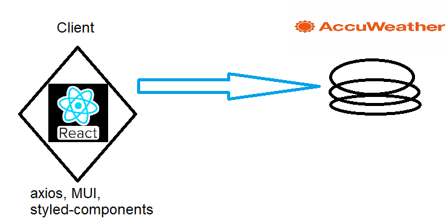

## Sharp - Weather app

<h2>Tech:</h2>

TypeScript, axios, Material-UI, styled-components, Redux-toolkit

Responsive app

<h3>Architecture</h3>

<h3>Install</h3>

download

extract

npm install

go to ./.env - change it to you personal "AccuWeather" apikey

npm run build

localhost:3000

Enjoy 🍿🍿🍿

